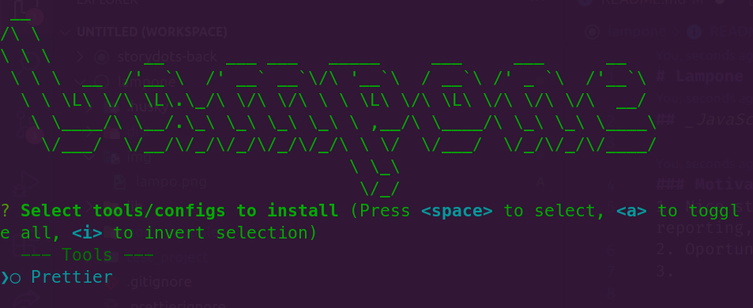

# Lampone

## _JavaScript/NodeJS CLI ToolKit_

### Motivation

1. Nice start point to learn best development practises (Documentation, Issue reporting, package publishing, Typescript, etc).
2. Oportunity to work and collaborate with other devs.
3.

### Usage (no installation needed)

`npx lampone`

